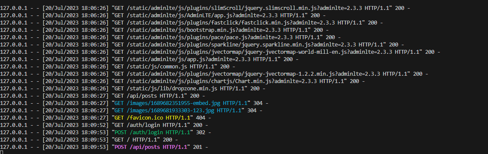
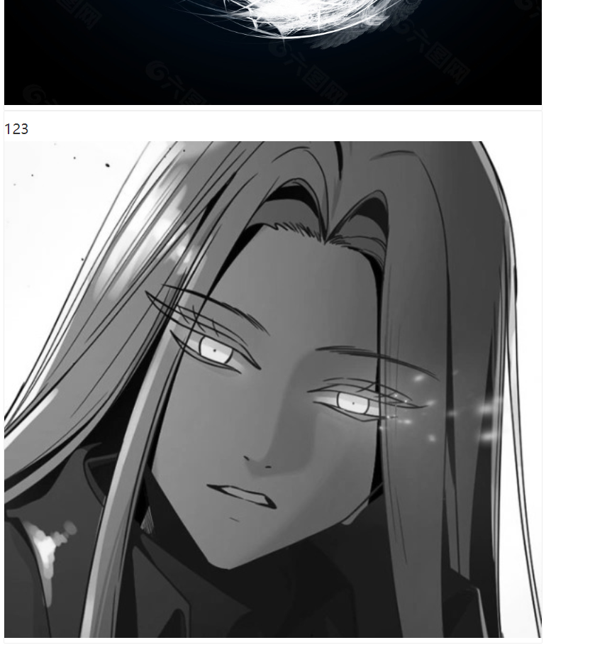

# 实验报告

刘家榕 2020212063023

# 实验目的

复习学过的数字内容安全相关内容，用Python实现一个基于数字水印的隐蔽通信系统

# 实验原理

实例是通过flask搭建一个可以上传图片的网站。之后通过sender来将一幅图片加入水印信息之后上传。能看到上传的含水印的图片，之后在将图片抓取到，这样通过本地上的网站成功将含秘密信息的图片传播。之后由于双方都有用于加解密水印的密钥，所以可以轻松找到水印信息，由此实现了隐蔽通信系统。

# 实验环境与工具

Windows 11 22621.1992

VScode 1.80.1


* [搭建网站](https://github.com/anjingcuc/covert_communication)
* 

* [示例代码](https://github.com/anjingcuc/covert_communication)
* 


# 实验流程

## 1.首先搭建实验环境

```
# 如果没有安装过 pipenv，请执行以下一条命令完成 pipenv 安装
pip install pipenv

# 安装开发环境所需所有依赖
pipenv install

# 如果在后续代码执行过程中遇到版本兼容性相关错误，可以使用以下命令安装本仓库调试验证过的所有依赖库精确依赖版本
pipenv install --ignore-pipfile

# 进入“纯净”开发环境
pipenv shell
```


```
# 初始化数据库

flask db init

# 生成迁移文件

flask db migrate

# 迁移数据库，即创建database以及各个表

flask db upgrade

# 创建管理员账号

flask user create-admin <username@email.com> <username> <password>

# 运行站点

flask run
```


## 之后网站已经建立

在本地电脑上的http://127.0.0.1:5000/

打开后出现登录界面之后通过之前建立的管理员邮箱和密码登录即可


经过检验，可以正常上传图片。

## 上传图片并接收图片

打开sender.py修改信息，包括用户名，密码，上传的文字和上传图片的位置


运行sender.py


检验：




已上传！

-----

之后运行receiver.py


成功接收图片！


## 检验

原加密图与接收到的图像进行比较


经过比较两个图像的MD5是一致的！

## 2.加入水印

首先加入如hello world水印：


然后上传再加载


然后得到了

可以发现其水印是hello world符合所求

## 3.盲水印


将图像加入盲水印




结果：


所以可以产生盲水印并读出水印信息的。

# 应用领域

如果是盲水印，那么可以用于秘密信息的传输，可以去传递少量信息。同时由于盲水印的不可见性，所以方便于隐藏。


如果是明水印，那么可以用于版权保护，比如加入@xxxx等来保护个人的权益。明水印意义之一是为了让其他用户看到，所以不需要隐蔽。

# 实验的问题


由于网站只能接收并提取jpg图像。而jpg会导致图像有损压缩，所以使得图像如果是jpg似乎用png的方法难以提取到有效信息

